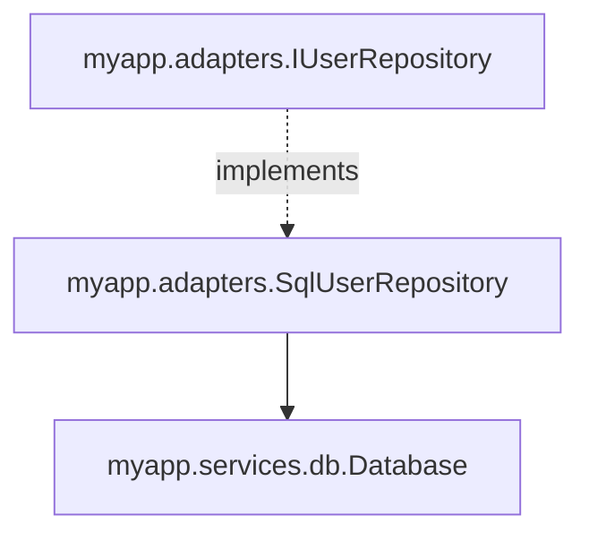

# Inspecting bindings

The Spring Boot `/actuator/beans` analog. `django_autowired.inspect` answers
the "what's wired to what?" question without requiring a running container.

## Quickstart — CLI

```bash
python -m django_autowired inspect myapp.services myapp.adapters
```

Default output is a table:

```
INTERFACE                         IMPLEMENTATION                         SCOPE      KIND       SOURCE
--------------------------------  -------------------------------------  ---------  ---------  ---------------------
myapp.services.email.SmtpClient   myapp.services.email.SmtpClient        singleton  concrete   myapp.services.email
myapp.adapters.IUserRepository    myapp.adapters.SqlUserRepository       singleton  interface  myapp.adapters
myapp.adapters.IPaymentGateway    myapp.adapters.StripePaymentGateway    singleton  interface  myapp.adapters
```

## Output formats

| `--format` | Description |
| --- | --- |
| `table` *(default)* | Plain-text aligned columns. |
| `tree` | ASCII tree with each binding's constructor dependencies as children. |
| `json` | JSON array of binding rows. Easy to pipe into `jq` or another tool. |
| `mermaid` | Mermaid `graph TD`. Paste into a Mermaid renderer to visualize. |

### Tree

```bash
python -m django_autowired inspect myapp --format tree
```

```
├── myapp.adapters.IUserRepository  →  myapp.adapters.SqlUserRepository  [singleton]
│   └── myapp.services.db.Database
├── myapp.services.email.SmtpClient  →  myapp.services.email.SmtpClient  [singleton]
└── myapp.services.greeter.GreetingService  →  myapp.services.greeter.GreetingService  [singleton]
    └── myapp.services.email.SmtpClient
```

### JSON

```bash
python -m django_autowired inspect myapp --format json | jq '.[] | select(.kind=="interface")'
```

### Mermaid

```bash
python -m django_autowired inspect myapp --format mermaid
```



## Excluding packages

`--exclude` adds to the built-in skip list (`migrations`, `tests`, …):

```bash
python -m django_autowired inspect myapp --exclude generated --exclude legacy
```

## Programmatic API

```python
from django_autowired import inspect

inspect.scan("myapp.services", "myapp.adapters")
rows = inspect.report()

for row in rows:
    print(f"{row.interface} -> {row.implementation} ({row.scope})")
```

Each row is a frozen `BindingReport`:

```python
@dataclass(frozen=True)
class BindingReport:
    interface: str          # "myapp.ports.IUserRepository"
    implementation: str     # "myapp.adapters.SqlUserRepository"
    scope: str              # "singleton" | "transient" | "thread"
    kind: str               # "concrete" | "interface"
    source_module: str      # "myapp.adapters"
    dependencies: list[str] # ["myapp.services.db.Database"]
```

The module also exports the four renderers:

```python
from django_autowired.inspect import render_table, render_tree, render_json, render_mermaid
```

## When to use this

- **Onboarding**: new engineers get a map of your DI graph in one command.
- **Code review**: catch accidental duplicate bindings or wrong scope.
- **Boot diagnostics**: print the report at startup in a non-prod env.
- **CI guard**: snapshot the report as JSON and fail the build if it drifts
  from an approved baseline.

!!! tip "Does not need a running container"
    `inspect.report()` reads the registry directly, so you can call it in
    tests or scripts without initializing a backend.
